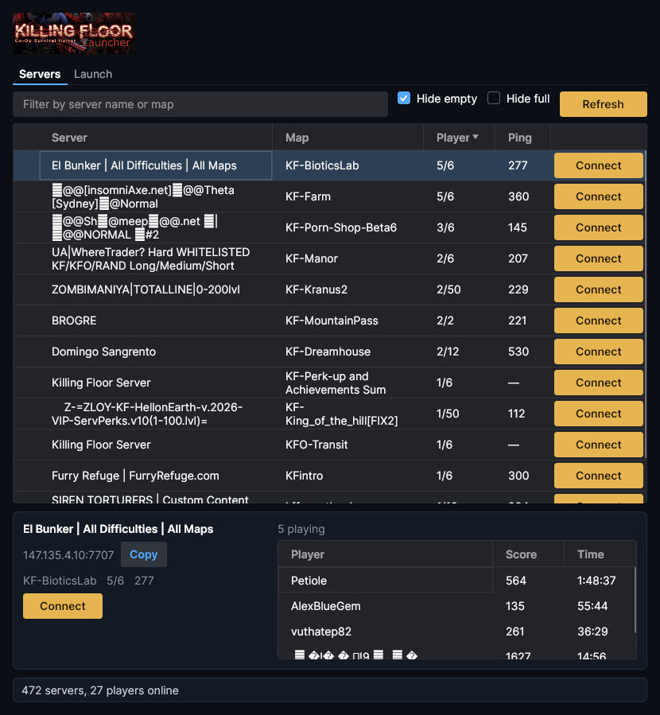
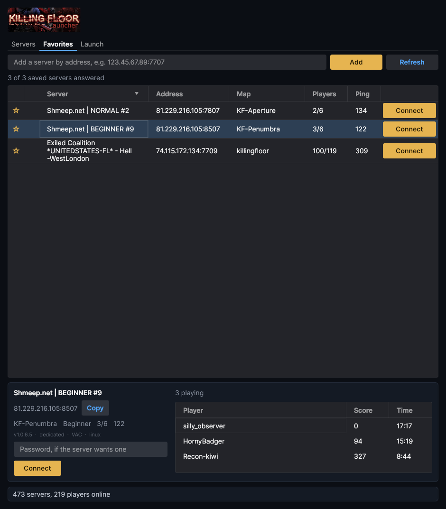
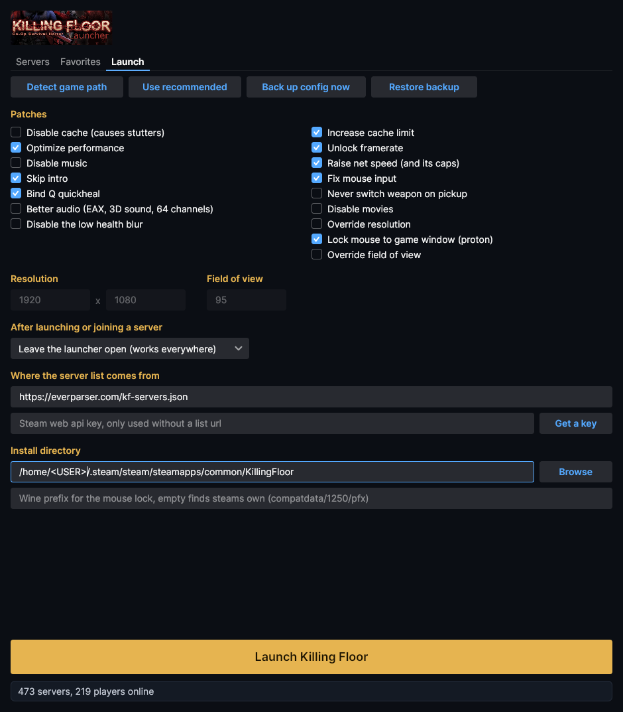

# KillingFloorLauncher


[Download for Windows](https://github.com/solenum/KillingFloorLauncher/releases/latest/download/KFLauncher-windows-x64.exe) · [Download for Linux](https://github.com/solenum/KillingFloorLauncher/releases/latest/download/KFLauncher-linux-x64)

Both are single self-contained files, no runtime to install: download, run it (on linux `chmod +x` first).  macOS has to be built from source for now, `dotnet build KFLauncher/KFLauncher.csproj` with the .NET 10 SDK.

# What is this?
This is a standalone-launcher for Killing Floor (1).

The goal of this launcher is to inject the games configuration files with some sane values to provide a better playing experience.  Every one of these is a checkbox on the Launch tab, and every one of them goes back to the stock value when you untick it:
* **Uncapped frame-rate**, and the detail-dropping frame rate smoothing that reads as stutter turned off
* **Improved net speed**, asking for the most the game's own rate caps allow.  Those caps (`MaxClientRate`, `MaxInternetClientRate`) are deliberately left at stock, and put back if something has raised them: past stock the client asks a busy server for more than it will give, and you get dropped a minute into a wave
* **Better mouse input**: smoothing and acceleration off, sampling matched to a 1000Hz mouse, and `ReduceMouseLag` *off*, which despite the name is a full gpu flush every frame
* **Field of view** (the stock 85 is cropped rather than widened on a widescreen monitor, and the game resets it at trader time, so the launcher sets it in the config *and* chains it onto the forward bind)
* **Mouse locked to the game window** under proton, so the cursor cannot wander onto a second monitor mid-wave
* **Better audio**: EAX, 3D sound and 64 channels instead of the safe defaults OpenAL ships with
* **No low-health blur**, and **no weapon switching when you walk over a pickup**

Keys the game has not written yet are added, in the right section, rather than silently skipped, and a key that means one thing in one section and another elsewhere (`MaxClientRate` is the net driver *and* the demo recorder) is only touched where it counts.  Binds are yours: the fov and netspeed commands are hung off the end of whatever you already have bound and taken back off cleanly, and a key you have bound to something of your own is left alone entirely.

It also has a server browser, so you can find a server and jump straight into it without going through the in-game menus.



Most of these improvements will be noticable right away.  The one caveat to this is the capped frame-rate in multiplayer, **which is uncapped as soon as you press any mouse button.**

This tool by default works with the steam version of Killing Floor, but should work with non-steam versions if you supply the game directory path manually.

Windows and linux (including proton) are both supported, macos builds but is untested.

### **Modifying settings in-game can overwrite this tools changes, be sure to change your settings in-game first and then re-launch the game via this tool!**

## How to use this tool
Download the release for your platform, put it wherever you like and run it.

The tool finds your install by reading steams own library index (`libraryfolders.vdf`), so it picks up games on other drives and external disks as well, on windows, linux and macos.  If that fails, point it at the directory yourself on the Launch tab.

Clicking 'Launch Killing Floor' injects the config and starts the game through steam.

Your config files are backed up the first time the launcher runs, and 'Restore backup' puts them back.  If that first backup caught them in a state, or you have since set the game up the way you like it, 'Back up config now' replaces the backup with the files as they stand.

Under proton the mouse lock needs the wine prefix the game runs in.  That is found automatically for a steam copy; for anything else (a non-steam shortcut, lutris, your own `WINEPREFIX`) there is a box for it under the install directory.

If the game is lacking config files or they are malformed, the tool will attempt to generate a default one (based on the default configuration the game generates for new installations), it will then inject that config and launch the game.

## Server browser
The 'Servers' tab lists every Killing Floor server steam knows about, with live player counts, map, difficulty and ping.  Password protected servers are marked with a padlock, and there is a box in the details panel to give one a password.  Filter by name or map, by difficulty, to dedicated servers only, and (on by default) away from servers running a build you cannot join.

Clicking a server opens a panel underneath with its address, a copy button, what steam knows about it (version, VAC, which OS, bots) and who is playing right now: names, scores and how long they have been in.  A selected server keeps itself up to date every few seconds for as long as it stays selected, so you can watch a server fill up.  Nothing else is polled, and nothing refreshes on a timer.  Hitting 'Connect' (or double clicking the row) injects your config and then starts the game on that server.

Window size, column widths and the sort you left it on are remembered.

## Favorites
The star in the first column saves a server.  The 'Favorites' tab lists what you have starred, refreshes it on its own (so you can see who is on your usual server without loading the whole list) and takes an address directly, `123.45.67.89:7707` or a hostname, for servers steam does not list or that you were simply handed.  Saved servers live in your settings file, keep their password, and survive a refresh, a restart and the server dropping off steams list entirely.

Give it the port you would type after `open` in the console.  Unreal answers server queries one port above the game, so that is tried first and the port as given second, and whatever the server reports for itself wins over either.



## How connecting works
That goes through `steam://run/1250//<ip>:<port>/` rather than the obvious `steam://connect`, because steam works out which game a `connect` link belongs to by querying the server, and KF servers do not report an app id it accepts: you get "app id specified by server is invalid" on either the game port or the query port.  Naming the app in the url and letting unreal take the address as a launch argument sidesteps the lookup entirely.

By default the launcher stays open once the game is on its way.  You can have it minimize or close instead under 'After launching' on the Launch tab, though note that minimizing stops the window being painted, and tiling window managers that keep it on screen anyway (bspwm, i3, ...) will show a stale window until you resize it, so leave it open or close it there.

If Killing Floor is already running, steam has no way in: it drops launch arguments for an app it is already running, and `steam://connect` asks the server for an app id that KF servers do not report.  So in that case the launcher copies the console command to your clipboard instead, press ~ in game and paste it.

The list itself has to come from the steam web api, because valves old keyless master server no longer resolves.  There are two ways to feed it:

* **A list url.**  One machine polls steam with one api key and serves the result, and every launcher reads that.  Nobody else needs a key.  Releases ship pointed at `https://everparser.com/kf-servers.json`, so out of the box there is nothing to set up.
* **Your own api key.**  Grab one from [steamcommunity.com/dev/apikey](https://steamcommunity.com/dev/apikey) and paste it into the launcher once, it is stored with the rest of your settings.

Player counts, ping and the padlock are read straight from the servers themselves over A2S either way, no key involved.

## Hosting the list for everyone
`tools/` has everything: a script that asks steam for the list and writes it out, plus a systemd timer that runs it every 30 seconds.  The file it writes is steams own reply byte for byte, so the launcher reads a relay and the api directly with the same code.

```sh
sudo install -m 755 tools/kf-serverlist.sh /usr/local/bin/
sudo install -m 644 tools/kf-serverlist.service tools/kf-serverlist.timer /etc/systemd/system/

# the key lives here and nowhere else, never in git
printf 'STEAM_API_KEY=%s\n' "$YOUR_KEY" | sudo tee /etc/kf-serverlist.env
sudo chmod 600 /etc/kf-serverlist.env

sudo systemctl enable --now kf-serverlist.timer
```

It writes `/var/www/html/kf-servers.json` by default (`OUT=` in the env file changes that), ~160KB for the ~500 servers that are usually up.  Serve that path with whatever webserver you already run, then point launchers at `https://yourhost/kf-servers.json` in the 'Where the server list comes from' box.

To make that the default for everyone who downloads a release, set `DefaultListUrl` in `KFLauncher/Models/ServerBrowser.cs` before tagging.  The launcher then just works, with the api key box as a fallback if your host is down.

## Why did you make this
I got tired of fixing my config files every time the game broke them.  Why not set them as read-only you ask?  Doing so will prevent other important changes from saving, such as skin selection, server favorites, input settings etc etc.

On-boarding friends into the world of Killing Floor is also a difficult task when the game runs terribly out of the box and requires some digging into configuration files and changing a bunch of values, which is off-putting to begin with.

## Future plans
This tool is very early-stage and only does some basic QoL changes.  While it is a simple operation, it saves the headache of dealing with the game overwriting your configuration changes constantly, and helps with on-boarding new people to the game without having them dig into configuration files to get the game playable.

Future plans include some of the following:
* ~~The ability to select what patches you want this tool to apply~~
* The ability to modify most/all in-game settings from the launcher
* ~~An embeded server-browser, with favorites, ability to connect from launcher, etc~~ (favorites and a password prompt still to come)
* Joining a server without closing the game first, if steam ever grows a way in
* ~~Make less ugly~~
* Fix the many bugs that exist

## Building it yourself
Needs the .NET 10 SDK, nothing else:

```sh
dotnet build KFLauncher/KFLauncher.csproj
dotnet run --project KFLauncher/KFLauncher.csproj -- --selftest
```

`--selftest` checks the parts that are easy to break quietly: the A2S info and player parsers, the server list parser, the ini patcher, the wine registry patcher and the running game detection.  Pushing a `v*` tag builds the self contained binaries for both platforms and puts them on a release.

### Screenshot
The patches, and where the launcher gets its server list from:


